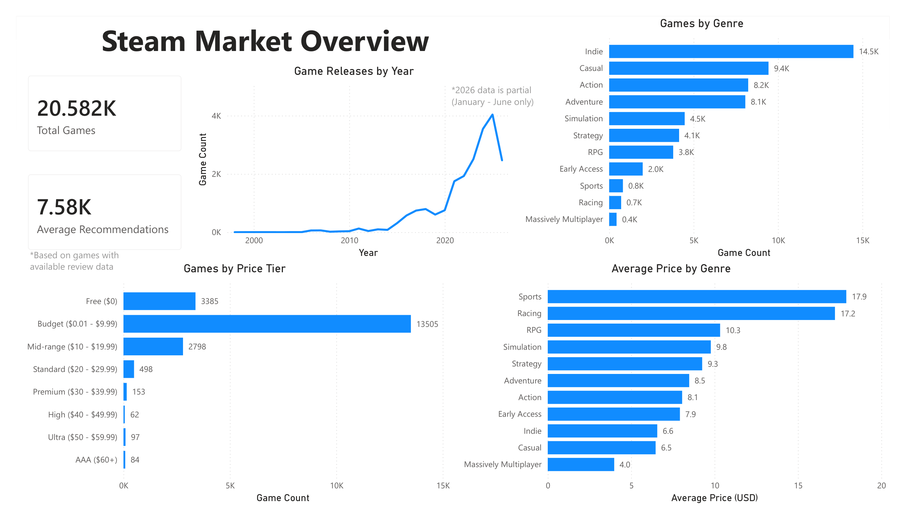
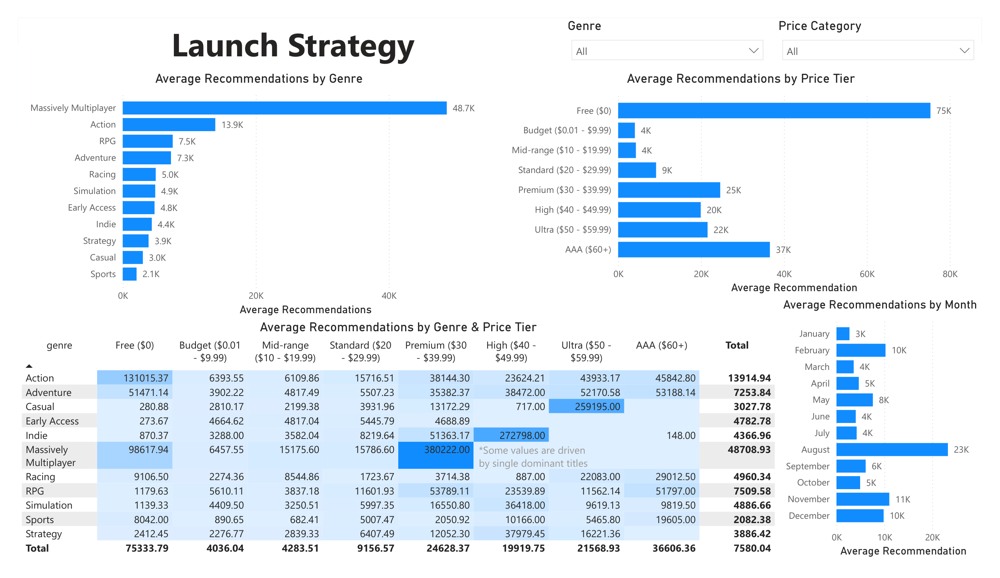
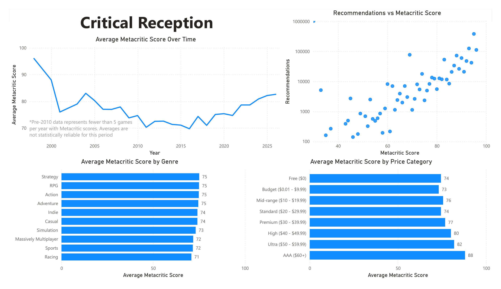

# Launch View

## Business Question
What genre, price point, and launch window allows publishers the best chance of a strong 30-day player retention on Steam?

## Project Overview

## Stack

## Data Sources

## Project Structure
launch-view/
├── notebooks/
│   ├── ingest.py
│   ├── get_applist.py
│   ├── ingest_batch.py
│   └── clean.ipynb
├── sql/
│   └── analyses/
│       └── analysis.sql
├── data/
│   ├── raw/          # gitignored
│   └── processed/    # gitignored
├── dashboards/
│   ├── dashboard.pbix
│   ├── dashboard.pdf
│   └── screenshots/
├── docs/
│   └── steam_launch_strategy_memo.pdf
├── requirements.txt
└── README.md

## How to Run

## Key Findings

## Dashboard

[Dashboard](dashboards/dashboard.pdf)

## Memo
[Steam Launch Strategy Memo](docs/steam_launch_strategy_memo.pdf)

## Limitations